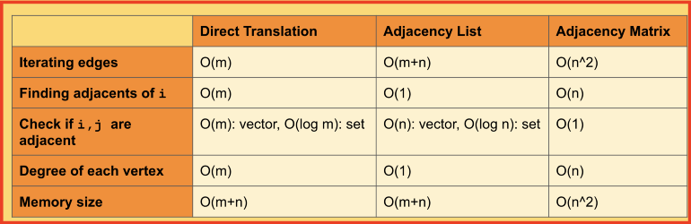

# Graph and its representations

A graph is a data structure that consists of the following two components:

1. A finite set of vertices also called as nodes.
2. A finite set of ordered pair of the form (u, v) called as edge. The pair is ordered because (u, v) is not the same as (v, u) in case of a directed graph(di-graph). The pair of the form (u, v) indicates that there is an edge from vertex u to vertex v. The edges may contain weight/value/cost.

Graphs are used to represent many real-life applications: Graphs are used to represent networks. The networks may include paths in a city or telephone network or circuit network. Graphs are also used in social networks like linkedIn, Facebook. For example, in Facebook, each person is represented with a vertex(or node). Each node is a structure and contains information like person id, name, gender, and locale. See this for more applications of graph.

The following two are the most commonly used representations of a graph.

1. Adjacency Matrix
2. Adjacency List

There are other representations also like, Incidence Matrix and Incidence List. The choice of graph representation is situation-specific. It totally depends on the type of operations to be performed and ease of use.

## Adjacency Matrix:

Adjacency Matrix is a 2D array of size V x V where V is the number of vertices in a graph. Let the 2D array be adj[][], a slot adj[i][j] = 1 indicates that there is an edge from vertex i to vertex j. Adjacency matrix for undirected graph is always symmetric. Adjacency Matrix is also used to represent weighted graphs. If adj[i][j] = w, then there is an edge from vertex i to vertex j with weight w.

Pros: Representation is easier to implement and follow. Removing an edge takes O(1) time. Queries like whether there is an edge from vertex ‘u’ to vertex ‘v’ are efficient and can be done O(1).

Cons: Consumes more space O(V^2). Even if the graph is sparse(contains less number of edges), it consumes the same space. Adding a vertex is O(V^2) time.
Please see this for a sample Python implementation of adjacency matrix.

## Adjacency List:

An array of lists is used. The size of the array is equal to the number of vertices. Let the array be an array[]. An entry array[i] represents the list of vertices adjacent to the ith vertex. This representation can also be used to represent a weighted graph. The weights of edges can be represented as lists of pairs.

## Comparison of different implementations

The first method, direct translation, seems to have low memory size, but finding adjacents of a vertex takes O(m), where m is the number of edges.

The adjacency list improves the runtime complexity for finding adjacents of a vertex. However, if we just want to check if nodes i, j are adjacent, the runtime is still not constant.

Adjacency matrix has the highest space, but due to the nature of vector’s access time, you can quickly check to see if two nodes are adjacent in constant time.

## Trade-off between std::vector, std::set, and std::list:

There is some trade-off between using STL’s vector, set, or list to represent the vertices and the edges.

Let’s review some main differences:
### std::set:
- A set is automatically sorted
- Insert/Delete/Find in set takes O(log n)
### std::unordered_set:
- An unordered set is not sorted
- Insert/Delete/Find in set takes O(log 1)
### std::vector:
- A vector is not sorted
- Insert/Delete/Find in set takes O(n)
### std::list:
- A list is not sorted
- Find in set takes O(n)
- Insert/Delete in set takes O(1)

Based on this, if you want to keep your edges or vertices sorted, you should probably go with a set. If you want a very fast search time, you should go with an unordered_set.

If find time is not that important, you can go with a list or a vector. But there is one more important reason that one might use a vector/list instead of set, which is representing multigraph: