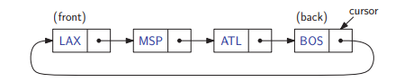

# Circularly Linked Lists

A circularly linked list has the same kind of nodes as a singly linked list. That is,
each node in a circularly linked list has a next pointer and an element value. But,
rather than having a head or tail, the nodes of a circularly linked list are linked
into a cycle. If we traverse the nodes of a circularly linked list from any node by
following next pointers, we eventually visit all the nodes and cycle back to the
node from which we started.

Even though a circularly linked list has no beginning or end, we nevertheless
need some node to be marked as a special node, which we call the cursor. The
cursor node allows us to have a place to start from if we ever need to traverse a
circularly linked list.

There are two positions of particular interest in a circular list. The first is the
element that is referenced by the cursor, which is called the back, and the element
immediately following this in the circular order, which is called the front. Although
it may seem odd to think of a circular list as having a front and a back, observe that,

if we were to cut the link between the node referenced by the cursor and this node’s
immediate successor, the result would be a singly linked list from the front node to
the back node.



We define the following functions for a circularly linked list:
- **front()**: Return the element referenced by the cursor; an error results if the list is empty.
- **back()**: Return the element immediately after the cursor; an error results if the list is empty.
- **advance()**: Advance the cursor to the next node in the list.
- **add(e)**: Insert a new node with element e immediately after the cursor; if the list is empty, then this node becomes the cursor and its next pointer points to itself.
- **remove()**: Remove the node immediately after the cursor (not the cursor itself, unless it is the only node); if the list becomes empty, the cursor is set to null.

*A node of a circularly linked list:*

```
typedef string Elem;       // element type
class CNode {              // circularly linked list node
private:
  Elem elem;                 // linked list element value
  CNode* next;               // next item in the list
  friend class CircleList;   // provide CircleList access
};
```

*The class implementation of a circularly linked list:*

```
class CircleList {          // a circularly linked list
public:
  CircleList();               // constructor
  ˜CircleList();              // destructor
  bool empty() const;         // is list empty?
  const Elem& front() const;  // element at cursor
  const Elem& back() const;   // element following cursor
  void advance();             // advance cursor
  void add(const Elem& e);    // add after cursor
  void remove();              // remove node after cursor
private:
  CNode* cursor;              // the cursor
};
```

*The constructor and destructor:*

```
CircleList::CircleList(): cursor(nullptr) {} // constructor
CircleList::˜CircleList(){                   // destructor
    while(!empty()) 
        remove(); 
}
```

*Simple member functions:*

```
bool CircleList::empty() const { 
    return cursor == nullptr; 
}
const Elem& CircleList::back() const { 
    return cursor−>elem; 
}
const Elem& CircleList::front() const { 
    return cursor−>next−>elem; 
}
void CircleList::advance() { 
    cursor = cursor−>next; 
}
```

Let us consider insertion. Recall that insertions to the circularly linked list occur **after** the cursor. We begin by creating a new node and initializing its data member. If the list is empty, we create a new node that points to itself. We then direct the cursor to point to this element. Otherwise, we link the new node just after the cursor. 

*Inserting a node just after the cursor of a circularly linked list:*

```
void CircleList::add(const Elem& e) {      // add after cursor
    CNode* v = new CNode;                  // create a new node
    v−>elem = e;
    if (cursor == nullptr) {               // list is empty?
        v−>next = v;                       // v points to itself
        cursor = v;                        // cursor points to v
    }
    else {                                 // list is nonempty?
        v−>next = cursor−>next;            // link in v after cursor
        cursor−>next = v;
    }
}
```


Finally, we consider removal. We assume that the user has checked that the list is nonempty before invoking this function. (A more careful implementation would throw an exception if the list is empty.) There are two cases. If this is the last node of the list (which can be tested by checking that the node to be removed points to itself) we set the cursor to NULL. Otherwise, we link the cursor’s next pointer to skip over the removed node. We then delete the node. 

*Removing the node following the cursor:*

```
void CircleList::remove() {        // remove node after cursor
    CNode* old = cursor−>next;     // the node being removed
    if (old == cursor)             // removing the only node?
        cursor = nullptr;          // list is now empty
    else
        cursor−>next = old−>next;  // link out the old node
    delete old;                    // delete the old node
}
```

To keep the code simple, we have omitted error checking. In **front**, **back**, and **advance**, we should first test whether the list is empty, since otherwise the cursor pointer will be nullptr. In the first two cases, we should throw some sort of exception. In the case of advance, if the list is empty, we can simply return.

[Source](http://www.sso.sy/sites/default/files/data-structures-and-algorithms-in-c.pdf)